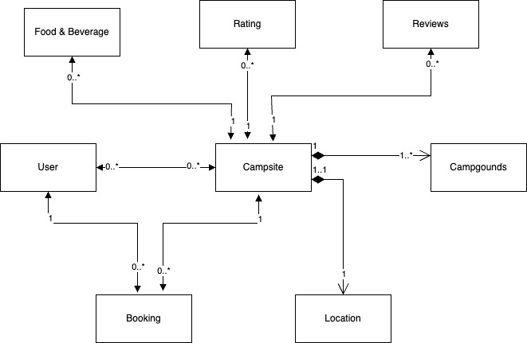

# Campion - Campsite Booking Web Application

Campion is a web application designed for camping enthusiasts to explore, book, and manage their camping experiences. Whether you're a campsite owner looking to showcase your location or a user eager to find the perfect camping spot, Campion has you covered.

## Authors
- [krishnan.pa@northeastern.edu](mailto:krishnan.pa@northeastern.edu)

## Project Overview

### Purpose
The purpose of Campion is to simplify and enhance the campsite booking process, providing a seamless experience for both campsite owners and users.

### Features

#### Campsite Owner Account
Campsite owners can easily register by providing essential details, including name, address, phone number, and a picture of the campsite. This registration process establishes them as campsite owners.

#### Campsite Details Management
Once logged in, campsite owners can add or edit details about their campsite, such as amenities, food options, and pricing information.

#### User Account Creation
Users can create an account by providing a username, email ID, and password. This account enables them to log in as customers to explore and book campsites.

#### User Dashboard
In the user dashboard, customers can:
- View a list of registered campsites.
- Explore detailed information about each campsite.
- Check campsite availability and book specific dates.View camp on map.
- View admin dash and insights, download csv
- Place a booking and proceed to checkout.
- Complete the booking by making a payment through card.
- Send email to our customer supprt

### Sample of our Usage for REST API

Campion provides a REST API with the following endpoints:

- **GET /campgrounds**: Retrieve a list of campgrounds based on provided parameters.
- **POST /campgrounds/new**: Create a new campground by providing the required information in the request body.
- **GET /campgrounds/:id**: Retrieve a specific campground by ID.
- **PUT /campgrounds/:id/edit**: Update a campground by providing the campground ID in the URL and the updated data in the request body.
- **DELETE /campgrounds/:id**: Delete a campground by providing the campground ID in the URL.

### Models
#### Base calls
The API uses a Campground model with the following attributes:
- name: Name of the campground (String, required).
- location: Location of the campground (String, required).
- type: Type of the campground (String, required).
- description: Description of the campground (String, required).
- price: Price of the campground (Number, required).
- campreview: Review of the campground (String, required).
- date: Date of the campground (String, required).

### Object Model Diagram

## Getting Started

### Prerequisites
- Node.js installed
- MongoDB installed and running

### Installation and Run Instructions

#### Backend
1. Clone the repository.
2. Navigate to the `Backend` folder.
3. Run `npm install` to install dependencies.
4. Start the server using `nodemon server.js`.

#### Frontend
1. Navigate to the `my-app` folder (UI).
2. Run `npm install` to install dependencies.
3. Run `npm run build-scss` to build the SCSS files.
4. Run `npm start` to start the frontend application.

Open your browser and go to [http://localhost:3000](http://localhost:3000) to access Campion.

## Contributing
If you'd like to contribute to Campion, please fork the repository and create a pull request. We welcome any suggestions, bug reports, or improvements.

## License
This project is licensed under the [MIT License](LICENSE).
